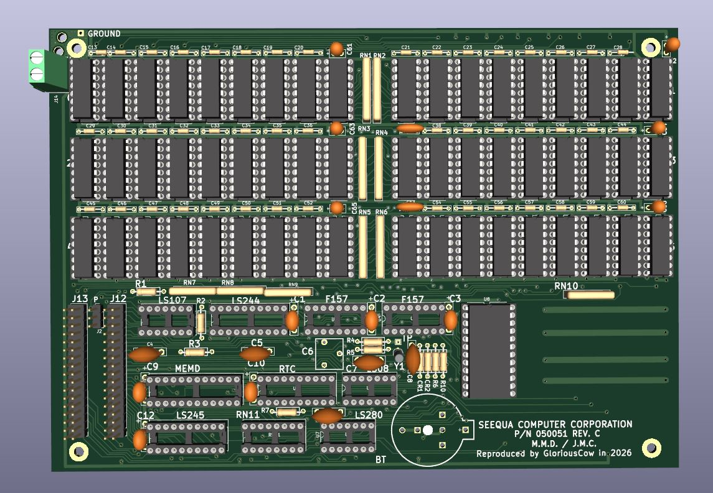

# Seequa Chameleon RAMPlus Expansion Board

This repository contains a KiCad project that reproduces the Seequa Chameleon RAMPlus expansion board, P/N 050051 REV C. 

This board has not yet been ordered and tested, but it does pass all design and electrical rule checks. If you want to be the first to try it, be my guest, but I make no guarantees there will be no bodges required. There almost certainly will be some issue I have missed.

This board will not function without the required PAL chips - so you will need a source for those. I hope to eventually figure out how to replace the PALs with a GAL or some other kind of PLD.

## Details and Modifications to the Original 

* **UART Option:** The current version of this board does not include the 8250 UART option found on some versions of the RAMPlus card.

* **Power Connections:** A screw terminal footprint has been added for power wiring if you'd like your board to be removable without fishing the molex plug out from the guts of your Chameleon, or if your power leads have broken off or otherwise detached.

  I am not sure what screw terminals will work given the tight clearances involved - when this has been verified I will update this README.

  The original strain relief pass-through holes and pads are still present if you would prefer to use them, and have been reinforced with plated through-holes and stitched copper fills for improved durability.

* **Parity RAM Jumper:** A new jumper J2 has been introduced. This allows configuration to skip populating the parity RAM chips if parity checking is not required.  Jumper pins 1&2 to enable parity, jumper pins 2&3 to disable it. This is independent of any software parity control.

* **Minor improvements:**
  * Where possible, ground and power traces have been enlarged. 
  * The footprints for the mounting posts have had their pads enlarged.
  * The strain-relief pass-through holes have been moved further way from the edge of the board.
  * The lower-right mounting post has been grounded.

## BOM 

The authoritative BOM should ideally be generated in KiCad, but RAMPlus_BOM.csv has been exported for your reference.
If you do plan to order one of these boards, please get in touch first to make sure there are no last minute updates that have not been reflected here.

## Sourcing Components

Some components may be difficult to find. The particular type of three-legged trimmer capacitor used to adjust the RTC crystal timing is no longer manufactured. Surplus trimmer caps are still available. One site selling them is here (no afffiliation or recommendation implied, caveat emptor):

https://www.surplussales.com/items/106928/ceramic-trimmer-capacitor/

The MM58167 RTC chip can regularly be found on eBay.

The board may be able to use 4164 DRAMs with some tweaks to capacitor values - Seequa populated the board with 4564s, which you can find on eBay or in bulk here:
https://www.electronicsurplus.com/mostek-mk4564n15-ic-memory-dram-64k-x-1
https://www.surplussales.com/items/147639/mostek-memory-dip/

## PALs

The RAMPlus card includes two new PALs, a DRAM decoder for the three new RAM banks, and an address decoder / control PAL for the RTC. These have yet to be dumped, but will be in time.

The RAMPlus w/ Serial option has a third PAL, SERB, to decode for the 8250.